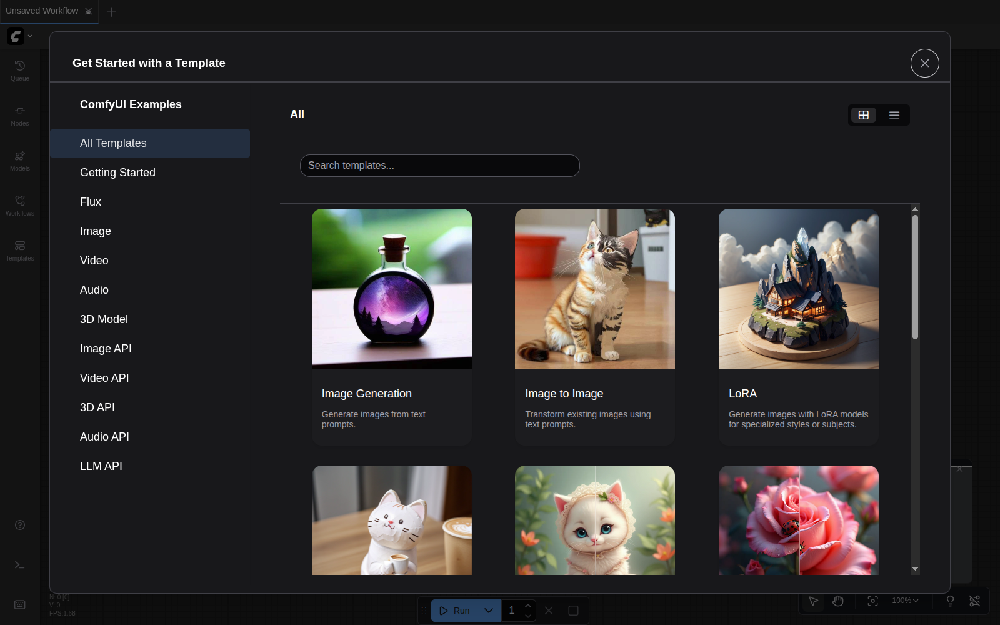
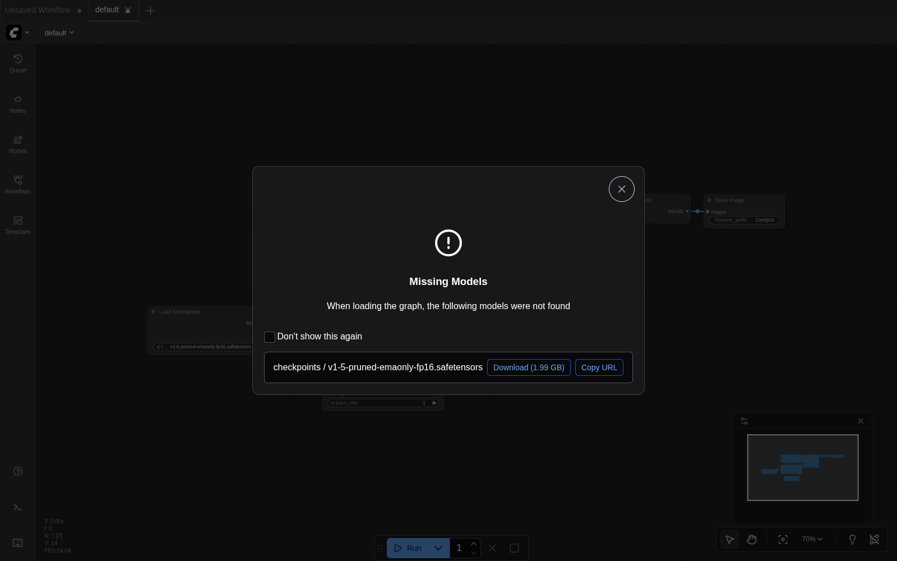
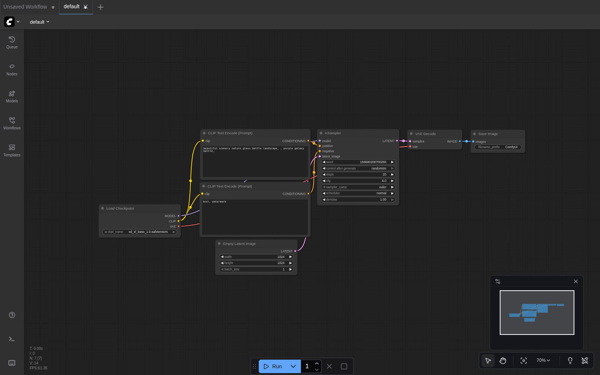
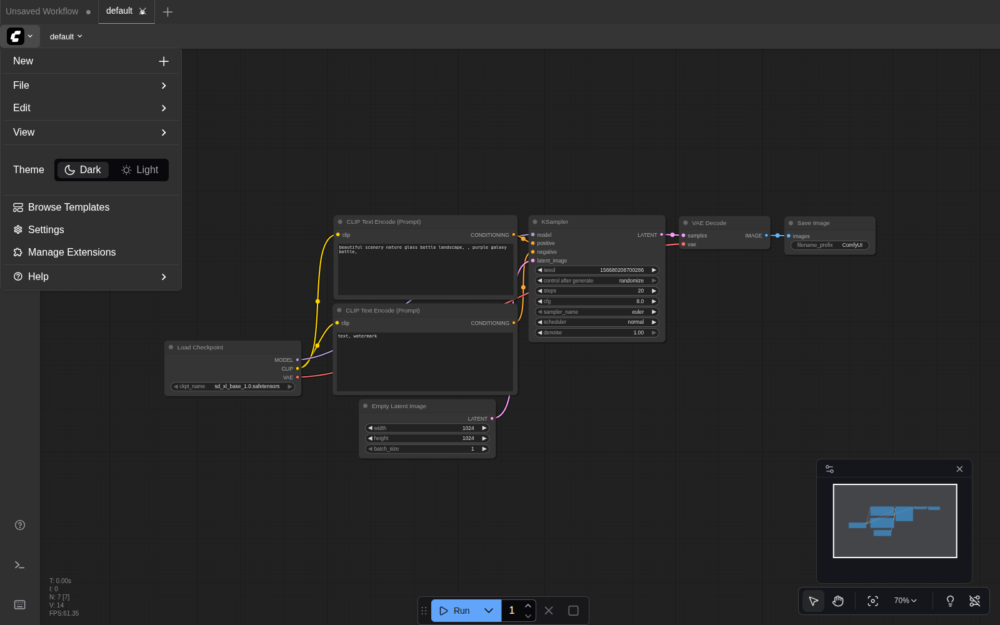
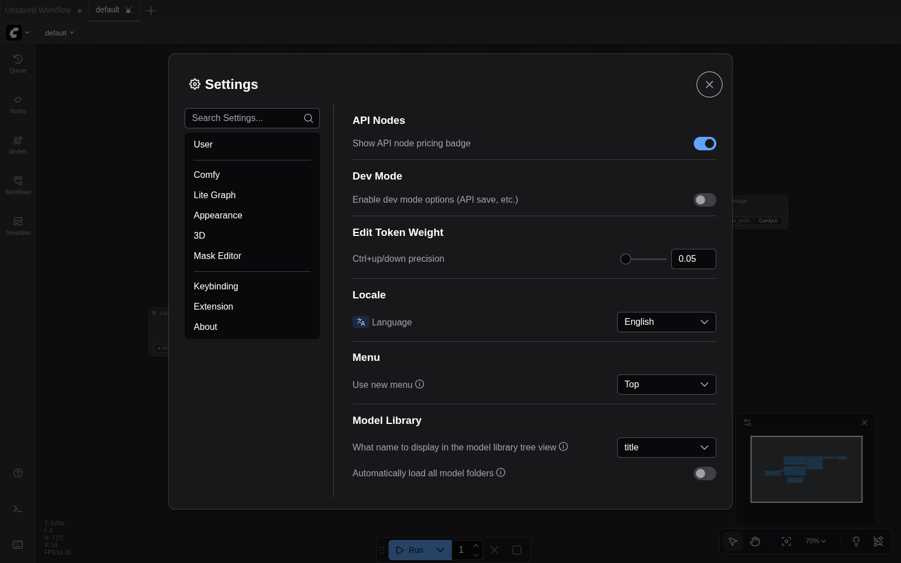
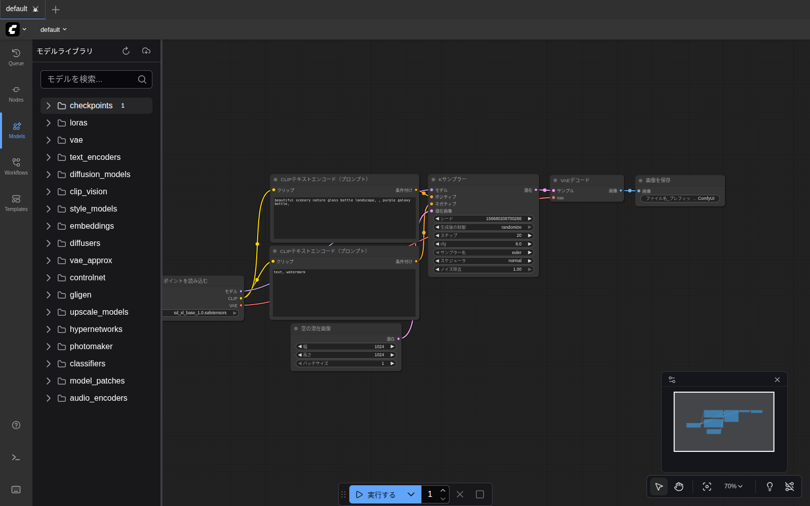

# 第2章 画面ツアー

ブラウザで `http://localhost:8188/` を開いてください。最初は「Get Started with a Template」というダイアログが出ます。

これは ComfyUI に同梱の **テンプレート集** で、用途別の出来合いワークフローから始められるようになっています。このガイドでは画像生成からスタートするので、左上の **「Image Generation」** カードをクリックしてください。

> 💡 ダイアログ右上の `×` で閉じることもできますが、そうするとキャンバスが空のままになります。テンプレート選択のほうがスムーズです。

## 「Missing Models」ダイアログが出たら

「Image Generation」テンプレートは内部的に SD 1.5 (`v1-5-pruned-emaonly-fp16.safetensors`) を初期値として持っているため、READMEの手順通り SDXL だけをダウンロードした環境では「Missing Models」ダイアログが出ます。

このダイアログは **左上の `×` で閉じてOK** です。次のステップで Load Checkpoint ノードのモデルを SDXL に切り替えるので、ここでは何もダウンロードしなくて構いません。

## 画面の5つのパーツ

ダイアログを閉じると、以下のような画面になります。

> 💡 **初回起動時の UI は英語表示です。** 以降の章で出てくるスクリーンショットは日本語に切り替えた状態のものなので、最初に [UIを日本語に切り替える](#uiを日本語に切り替える) を済ませてから読み進めると分かりやすいです。

最初は情報量が多くて圧倒されますが、覚えるべきパーツは **5つだけ** です。

| 番号 | 場所 | 名前 | 用途 |
|---|---|---|---|
| ① | 左端の細いバー | サイドバー（Queue / Nodes / Models / Workflows / Templates） | キュー / ノード / モデル / ワークフロー / テンプレートの切り替え |
| ② | 中央の広い領域 | キャンバス | ノードを並べる作業場。マウスホイールで拡大縮小、右クリックドラッグで移動 |
| ③ | 中央の各箱 | ノード | 1つの処理を担当する箱（後述） |
| ④ | 画面下中央 | コマンドバー | `▶ Run`（日本語表示なら `▶ 実行する`）ボタン。ここを押すと生成開始 |
| ⑤ | 右下の小さい四角 | ミニマップ | キャンバス全体の俯瞰図 |

## Load Checkpoint を SDXL に切り替える

左下の **「Load Checkpoint」**（日本語UIなら **「チェックポイントを読み込む」**）ノードのドロップダウンが、初期値で `v1-5-pruned-emaonly-fp16.safetensors` になっています。READMEのStep 7でダウンロードした SDXL に切り替えます。

1. ドロップダウンをクリック → 一覧が出る
2. `sd_xl_base_1.0.safetensors` を選択

ついでに **Empty Latent Image**（空の潜在画像）の `width` / `height` を **1024 / 1024** に変更しておきます（SDXL は 1024×1024 で学習されているため）。

> 💡 第4章でこのステップを改めて行うので、ここでは画面の見方を確認するだけでも構いません。

## UIを日本語に切り替える

画面が英語のままだと以降の章のスクリーンショット（ノード名やボタン）と表記が合わないため、最初に日本語化しておきます。

1. 画面 **左上の ComfyUI ロゴ**（青いC型のアイコン）をクリックすると、メニューが開きます

   

2. メニューの中から **Settings**（日本語UIの場合は **設定**）をクリック
3. ダイアログが開いたら、左サイドの **User**（日本語UIの場合は **ユーザー**）カテゴリを選択（最初から選ばれているはずです）
4. 右側を下にスクロールすると **Locale**（日本語UIの場合は **ロケール**）セクションが見つかります
5. **Language**（日本語UIの場合は **言語**）のドロップダウンを **日本語** に変更

   

6. 右上の × でダイアログを閉じる
7. **ブラウザを Ctrl+R でリロード** すると、UI が日本語に切り替わっています

> 💡 **元に戻したい場合** は同じ手順で `English` を選ぶだけです。設定はサーバー側に保存されるので、ブラウザや ComfyUI を再起動しても維持されます。

これ以降のスクリーンショットは日本語UIになります。

## 全体図（ノードが端まで見える状態）

テンプレート読み込み直後は自動でズーム調整され、すべてのノードが見える状態になっています。

このデフォルトワークフローは「画像を生成するための **最小構成**」です。次章で実際に動かします。今は **どんな箱（ノード）が並んでいるかだけ** 確認してください。

| ノード名 | 役割 |
|---|---|
| `チェックポイントを読み込む` | 画像生成 AI モデル（脳みそ）を読み込む |
| `CLIPテキストエンコード（プロンプト）` | あなたが入れた言葉を AI が分かる数値に変える。**ポジティブ** と **ネガティブ** の2つある |
| `空の潜在画像` | これから絵を描くための「真っ白なキャンバス」を用意する |
| `Kサンプラー` | **画像を実際に生成する** 中心ノード |
| `VAEデコード` | 「AI 内部の表現」を「人間の目で見える画像」に変換する |
| `画像を保存` | 結果を `output/` フォルダに PNG で保存する |

> 💡 **線の色** には意味があります。同じ色のソケット同士しかつなげません。ピンクは「画像」、紫は「モデル」、黄色は「テキスト→数値」、と覚えておけば十分です。

## サイドバー各項目の役割

左端のアイコンを順番に紹介します。

| アイコン | 名前 | 何ができる |
|---|---|---|
| 🕒 **Queue** | キュー | これまでに実行したジョブの履歴と結果一覧 |
| 📦 **Nodes** | ノードライブラリ | 新しいノードを検索して追加 |
| 📚 **Models** | モデルライブラリ | 今 PC に入っているモデルファイルの一覧（上図） |
| 🌀 **Workflows** | ワークフロー | 自分で保存したワークフローを呼び出す |
| 🎨 **Templates** | テンプレート | 公式の出来合いワークフローを呼び出す（最初に出たダイアログと同じもの） |

> 💡 **同じアイコンをもう一度クリック** すると、開いたサイドバーが閉じます。

> 💡 **`checkpoints` の右の数字（`1`）** は、いま models/checkpoints/ に入っているファイル数です。SDXL ベース1個だけ DL した直後は `1`、追加でモデルを置くと増えていきます。

## キャンバスの操作

| やりたいこと | 操作 |
|---|---|
| 拡大 / 縮小 | マウスホイール上下 |
| キャンバスを移動 | 何もない場所を **右クリックドラッグ** または **スペースキー押しながら左ドラッグ** |
| ノードを移動 | ノードのタイトル部分を左ドラッグ |
| ノードを選ぶ | ノードを左クリック |
| 全体が見えるようにフィット | キーボードの `.`（ピリオド）を押す |

> 💡 **慣れる前に複雑なことをしないのがコツ。** 今は「ノードを動かさず、ホイールで拡大縮小する」だけで進めましょう。

---

画面の見方を覚えたら、 [第3章 セットアップ](03_setup.md) に進みます。
