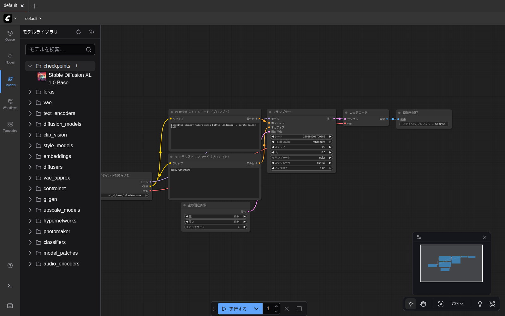

# 第3章 セットアップ — モデルを置く場所を知る

ComfyUI は **「モデル（学習済みの脳みそファイル）」** がないと何も生成できません。この章では、

- モデルがどこに置かれるのか
- 今入っているモデルを画面で確認する方法
- 足りないモデルを追加する方法

の3つを押さえます。

## モデルの保存場所

ComfyUI のインストール方法によって場所が異なりますが、典型的には次のディレクトリ構成です。

```
ComfyUI/
└── models/
    ├── checkpoints/      ← 画像・音楽の本体モデル（一番大きい）
    ├── clip/             ← テキストを数値化するモデル
    ├── text_encoders/    ← 同上（新形式）
    ├── vae/              ← 画像と数値の相互変換モデル
    ├── loras/            ← 微調整用の追加モデル
    ├── controlnet/       ← 構図を指定するモデル
    └── ...
```

このガイドの環境（Docker版）では、**ホスト側** の `~/comfyui-data/models/` がコンテナ内の `/workspace/ComfyUI/models/` にマウントされています。つまり、ホスト側の `comfyui-data/models/checkpoints/` にファイルを置けば、ComfyUI からそのまま見えます。

> 💡 ご自身の環境のモデルディレクトリの場所が分からない場合は、ComfyUI を起動したターミナルの最初のログを見ると `models folder: /xxx/yyy` のように出力されています。

## いま何のモデルが入っているか確認する

ComfyUI の画面で確認できます。

1. 左サイドバーの **Models**（モデルライブラリ）アイコンをクリック
2. 各フォルダ名の右に数字が出ます。これが「そのフォルダにあるファイル数」
3. フォルダ名をクリックすると中身が展開される



このスクリーンショットでは、`checkpoints` フォルダに `Stable Diffusion XL 1.0 Base` が1つだけ入っていることが分かります。これが第4章で使うモデルです。

> 💡 **モデルが画面に出てこない場合は、画面右上の「リロード」アイコン（円形矢印）** を押してください。ComfyUI 起動後にファイルを追加した場合、再読み込みが必要です。

## モデルを追加する3つの方法

### 方法A: ComfyUI の「ダウンロードボタン」を使う（GUIで完結したい人向け）

ComfyUI のテンプレートを開いた時、必要なモデルがなければ次のようなダイアログが出ます。


各行の **「ダウンロード」ボタン** を押すと、Hugging Face 等にホストされた公式の再パッケージ版が **ブラウザのダウンロードフォルダ** （Linux の Chrome なら `~/Downloads/`）に落ちてきます。

> ⚠️ **このボタンはブラウザの通常ダウンロードを起動するだけ** で、ComfyUI が自動で正しい配置場所に置いてくれるわけではありません。ダウンロード後、手動で **配置先フォルダに移動** する必要があります。

ダウンロード後、ダイアログ左側の表記（例: `checkpoints / v1-5-pruned-emaonly-fp16.safetensors`）が示すサブフォルダに移動します。本ガイドの環境（Docker版）では `~/comfyui-data/models/<サブフォルダ>/` です。

```bash
# 例: checkpoints / v1-5-pruned-emaonly-fp16.safetensors の場合
mv ~/Downloads/v1-5-pruned-emaonly-fp16.safetensors ~/comfyui-data/models/checkpoints/
```

移動後は ComfyUI 画面右上の **リロード** または `Ctrl+R` でブラウザをリロードしてください。

> 💡 配置場所を間違えても消えはしません。`~/Downloads/` に置いたまま気付くこともあるので、生成時にエラーが出たら配置先を再確認しましょう。

### 方法B: コマンドラインで直接ダウンロードする

URL が分かっている場合は `wget` や `curl` で **配置先を指定して** 直接落とすのが手間が少ないです。例えば Stable Audio Open のモデル：

```bash
cd ~/comfyui-data/models
wget -O checkpoints/stable-audio-open-1.0.safetensors \
  "https://huggingface.co/Comfy-Org/stable-audio-open-1.0_repackaged/resolve/main/stable-audio-open-1.0.safetensors"
```

ファイルサイズは数 GB あるので、回線速度によっては10分以上かかります。配置場所を後から考えなくて済むので、慣れているならこちらが速いです。

### 方法C: 手動で配置する

すでに `.safetensors` ファイルをお持ちの場合、`models/` 配下の対応するフォルダにコピー or 移動するだけです。

| ファイルの種類 | 置き場所 |
|---|---|
| `*.safetensors`（画像/音楽の本体） | `models/checkpoints/` |
| `t5-base.safetensors` などのテキストエンコーダ | `models/text_encoders/` |
| `*.vae.safetensors` | `models/vae/` |
| `*.lora.safetensors` | `models/loras/` |

配置後は ComfyUI 画面右上の **リロード** か、ブラウザを `Ctrl+R` でリロードしてください。

## このガイドで使うモデル一覧

これから使うモデルを一覧にしておきます。**第4章では追加モデル不要** ですが、**第6章以降は別途ダウンロード** が必要です。第6章のセットアップ時に同じ表をもう一度出します。

| 章 | ファイル | 配置先 | サイズ | 用途 |
|---|---|---|---|---|
| 第4章 | `sd_xl_base_1.0.safetensors` | `checkpoints/` | 6.5 GB | 画像生成 |
| 第7章 | `stable-audio-open-1.0.safetensors` | `checkpoints/` | 4.5 GB | 効果音・短い音楽 |
| 第7章 | `t5-base.safetensors` | `text_encoders/` | 850 MB | Stable Audio用テキストエンコーダ |
| 第8章 | `ace_step_v1_3.5b.safetensors` | `checkpoints/` | 7.2 GB | 音楽生成 |

合計で **約19GB** のディスク容量を使います。空き容量を事前に確認しましょう。

---

セットアップの考え方が分かったら、 [第4章 はじめての画像生成](04_image_generation.md) に進んでください。
