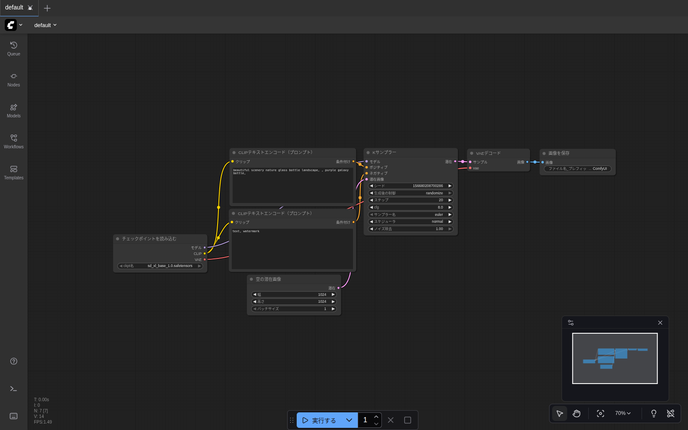
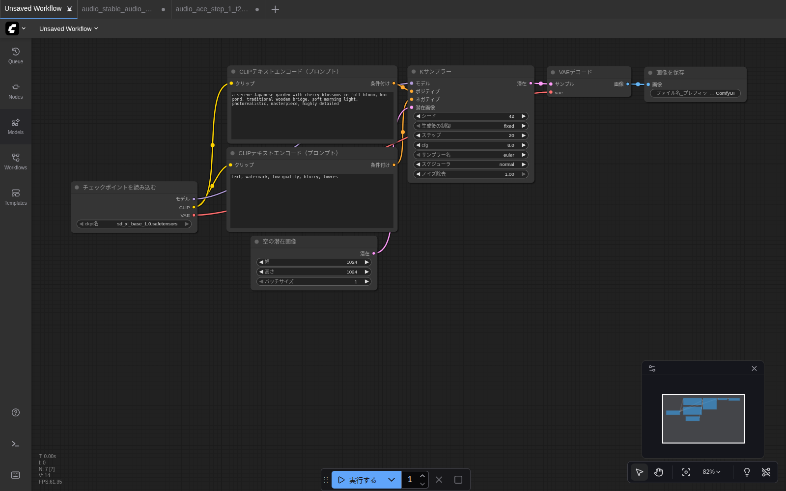
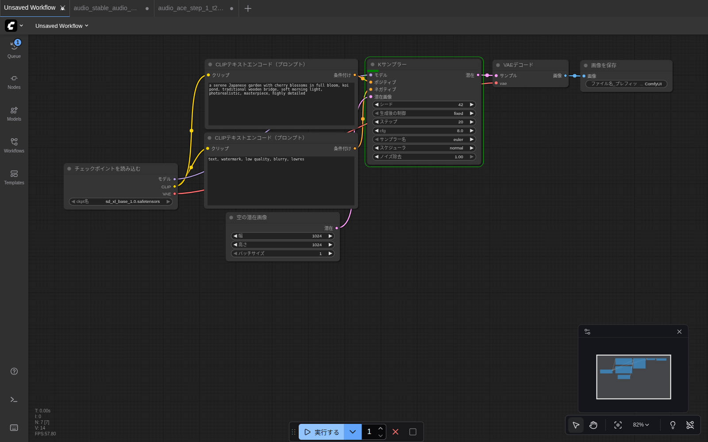
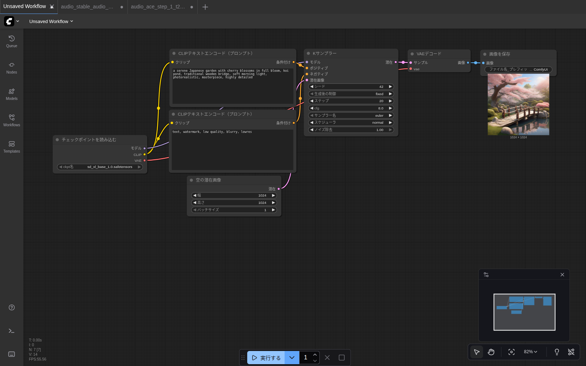
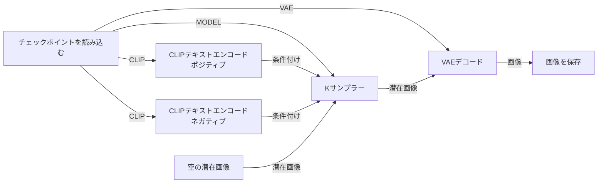

# 第4章 はじめての画像生成（SDXL）

ここで初めて「実際に動かす」ステップに入ります。**5分後** にあなたの画面に AI が描いた画像が出る予定です。

## 用意するもの

| 必要なもの | 確認方法 |
|---|---|
| `sd_xl_base_1.0.safetensors` が `models/checkpoints/` に入っている | 第3章の Models サイドバーで確認 |
| ブラウザで `http://localhost:8188/` が開ける | URLにアクセス |

> 💡 SDXL は約6.5GB のモデルです。**初回の生成は読み込みに 30秒〜1分** ほど余分にかかります（2回目以降は速い）。

## ステップ1：デフォルトワークフローを開く

第2章で **「Image Generation」テンプレート** を読み込んだ状態を引き継いで進めます。画面はこのようになっているはずです。



もし別のワークフローを開いている、またはキャンバスが空になっている場合は、左サイドバーの **Templates**（テンプレート）→ **画像** カテゴリ → **「Image Generation」** から再ロードしてください。

> 💡 **「Missing Models」ダイアログが出たら** `×` で閉じてください。テンプレート初期値の SD 1.5 モデルが見つからない通知ですが、READMEで SDXL を入れているので次のステップで切り替えます。

## ステップ2：Load Checkpoint を SDXL に切り替える、解像度を 1024×1024 に

「チェックポイントを読み込む」ノードのドロップダウンが初期値 `v1-5-pruned-emaonly-fp16.safetensors` になっているので、**`sd_xl_base_1.0.safetensors`** に変更します。

1. ノード下部のドロップダウンをクリック
2. 一覧から `sd_xl_base_1.0.safetensors` を選択

加えて **「空の潜在画像」** ノードの `幅` / `高さ` を **1024 / 1024** に変更します（SDXLは1024×1024で学習されているため、これで劇的に画質が上がります）。

1. 「空の潜在画像」ノードの **「幅」** の数字をクリック → `1024`
2. 同じく **「高さ」** も `1024`

`バッチサイズ` は枚数。今は `1` のままでOK。

> 💡 第2章で既に切り替え済みの場合はこのステップをスキップしてください。

## ステップ3：プロンプトを入力する

ワークフロー中央に **「CLIPテキストエンコード（プロンプト）」** という同じ名前のノードが2つ縦に並んでいます。

- **上のノード = ポジティブプロンプト**（描いて欲しいもの）
- **下のノード = ネガティブプロンプト**（描いて欲しくないもの）

それぞれのテキストエリアをクリックして、好きな英語の説明文を入力してください。最初は次の例をそのままコピペしてみましょう。

**ポジティブプロンプト（上のノード）に入れる：**
```
a serene Japanese garden with cherry blossoms in full bloom, koi pond, traditional wooden bridge, soft morning light, photorealistic, masterpiece, highly detailed
```

**ネガティブプロンプト（下のノード）に入れる：**
```
text, watermark, low quality, blurry, lowres
```

入力後、画面はこんな感じになります：



> 💡 **プロンプトは英語が無難です。** 日本語のプロンプトも書けますが、SDXL は英語で学習されているので、英語のほうが意図が伝わりやすい。

## ステップ4：実行する

画面下中央の **「▶ 実行する」** ボタンをクリックします。

クリックすると、ノードの周囲に **緑色の枠線** が走り、現在処理中のノードを示してくれます。下のスクリーンショットでは `Kサンプラー` が緑になっており、左サイドバーの Queue アイコンに `1` のバッジが付いています。



> 💡 **タブのタイトル** を見るとパーセンテージが進んでいきます（例: `[14%][50%] KSampler`）。「全体の何%」「Kサンプラーの何%」という意味です。

## ステップ5：結果を確認する

完了すると、右端の **「画像を保存」** ノードに生成された画像のプレビューが表示されます。



実際に生成された画像はこちら：


このファイルは PC の `output/` フォルダ（このガイドの環境では `~/comfyui-data/output/ComfyUI_00002_.png`）に自動保存されています。

> 💡 **画像をクリックすると拡大表示** されます。さらに「右クリック → Save Image」でブラウザから直接保存もできます。

## ノード単位で何が起きていたのか

簡単にまとめると、こういう流れです。



「**プロンプトをモデルが理解できる形にして、ノイズだらけの潜在画像から徐々にノイズを取り除いて、最後に人間の目で見える画像に戻す**」という流れです。

## よく触るパラメータの意味

`Kサンプラー` ノードに並ぶ設定の意味だけ覚えておくと自由度が上がります。

| 項目 | 意味 | 推奨値 |
|---|---|---|
| シード | 乱数の初期値。同じ値だと毎回同じ絵 | 試行中は `生成後の制御 = randomize` のままでOK。気に入った絵が出たら `fixed` で固定 |
| ステップ | 何回ノイズ除去を繰り返すか | SDXL は 20〜30 で十分 |
| cfg | プロンプトをどれだけ重視するか | SDXL は 6〜8 が定番 |
| サンプラー名 | ノイズ除去のアルゴリズム | 迷ったら `euler` か `dpmpp_2m` |
| スケジューラ | ステップ配分のしかた | `normal` か `karras` |
| ノイズ除去 | 1.0 で全部、0.5 だと半分だけノイズ除去（i2i用） | 通常 1.0 |

> 💡 「同じプロンプトでもう一度全く同じ絵を作りたい」場合は、シードを `fixed` にして同じ番号を入力してください。

---

最初の画像生成、お疲れさまでした 🎉  
次は [第5章 プロンプトを変えて遊ぶ](05_prompt_tips.md) で、もう少し自由に遊んでみましょう。
