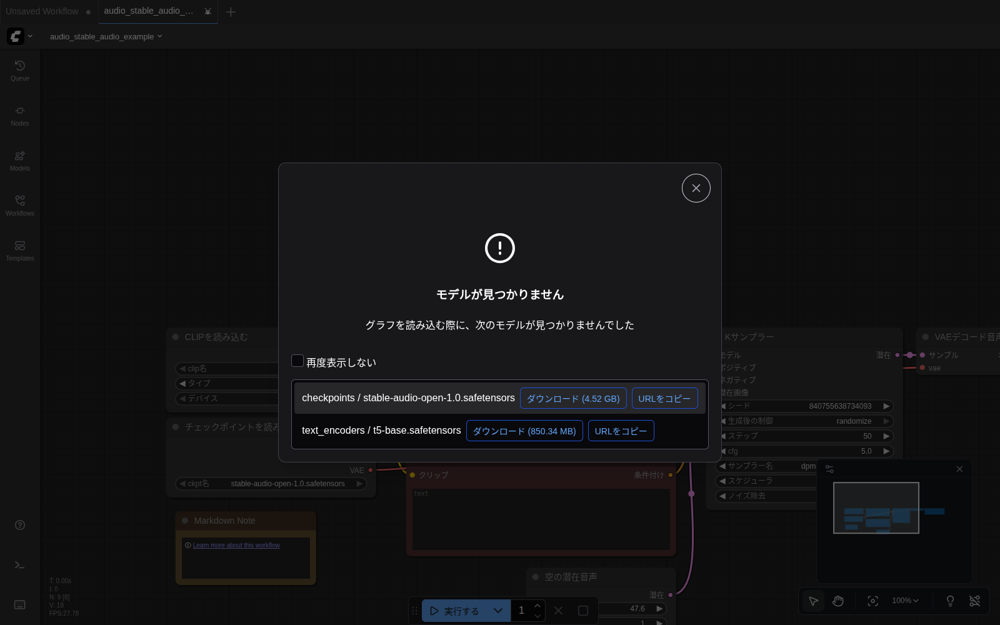

# 第6章 音楽生成の準備

ComfyUI は画像だけでなく **音楽の生成** もできます。このガイドでは2つの代表的なモデルを試します。それぞれ得意分野が違うので、用途で使い分けましょう。

| モデル | 得意なこと | このガイドの章 |
|---|---|---|
| **Stable Audio Open 1.0** | 効果音、環境音、短いインストゥルメンタル（〜47秒） | [第7章](07_stable_audio.md) |
| **ACE-Step v1** | 楽曲全体（ドラム+楽器+ボーカル）、最大4分弱 | [第8章](08_ace_step.md) |

> 💡 **どちらか片方でも構いません。** 両方やる場合は合計 約12.5GB のディスクと、それぞれ数分のダウンロード時間が必要です。

## モデルダウンロードの3つの方法

第3章で出てきた方法と同じです。

### 方法A：ComfyUI のダウンロードボタン（GUIで完結したい人向け）

1. 左サイドバーの **Templates** をクリック
2. カテゴリから **オーディオ** を選択

   

3. 使いたいテンプレート（例: Stable Audio）をクリック
4. **「モデルが見つかりません」** ダイアログが出る

   

5. 各行の **「ダウンロード」ボタン** を押す
6. **ブラウザのダウンロードフォルダ** （Linux の Chrome なら `~/Downloads/`）にファイルが保存される

> ⚠️ **「ダウンロード」ボタンはブラウザの通常ダウンロードを起動するだけ** です。ComfyUI が自動配置するわけではないので、ダウンロード後にダイアログ左側の表記（例: `checkpoints / xxx.safetensors`、`text_encoders / t5-base.safetensors`）に従って手動で移動します。

```bash
# Stable Audio の例（4.5GB + 850MB）
mv ~/Downloads/stable-audio-open-1.0.safetensors ~/comfyui-data/models/checkpoints/
mv ~/Downloads/t5-base.safetensors             ~/comfyui-data/models/text_encoders/
```

移動後、ダイアログを **× で閉じ** て ComfyUI 画面を `Ctrl+R` でリロードすると、ワークフローからモデルが認識されます。

### 方法B：コマンドラインで一括ダウンロード（おすすめ）

時間をかけずに済ませたい人向け。下のスクリプトをそのまま実行してください（このガイドの環境に合わせています）。

```bash
cd ~/comfyui-data/models
mkdir -p text_encoders

# Stable Audio Open 1.0（4.5GB）
wget -c -O checkpoints/stable-audio-open-1.0.safetensors \
  "https://huggingface.co/Comfy-Org/stable-audio-open-1.0_repackaged/resolve/main/stable-audio-open-1.0.safetensors"

# Stable Audio 用のテキストエンコーダ T5（850MB）
wget -c -O text_encoders/t5-base.safetensors \
  "https://huggingface.co/ComfyUI-Wiki/t5-base/resolve/main/t5-base.safetensors"

# ACE-Step v1 3.5B（7.2GB）
wget -c -O checkpoints/ace_step_v1_3.5b.safetensors \
  "https://huggingface.co/Comfy-Org/ACE-Step_ComfyUI_repackaged/resolve/main/all_in_one/ace_step_v1_3.5b.safetensors"
```

`-c` オプションは「途中で切れたら続きから再開」という意味です。回線が不安定でも安心。

> 💡 **`~/comfyui-data/models` の部分はご自身の環境のパスに置き換えてください。** ComfyUI の `models/` ディレクトリの場所です（第3章を参照）。

### 方法C：手動配置

すでにファイルをお持ちの方は、次の場所に配置：

| ファイル名 | 配置先ディレクトリ |
|---|---|
| `stable-audio-open-1.0.safetensors` | `models/checkpoints/` |
| `t5-base.safetensors` | `models/text_encoders/` |
| `ace_step_v1_3.5b.safetensors` | `models/checkpoints/` |

## ダウンロード完了の確認

3つすべてダウンロードできたら、次のように確認できます。

```bash
ls -la ~/comfyui-data/models/checkpoints/
ls -la ~/comfyui-data/models/text_encoders/
```

期待される表示：

```
checkpoints/
  ace_step_v1_3.5b.safetensors          (約 7.2 GB)
  sd_xl_base_1.0.safetensors            (約 6.5 GB) ← 第4章の画像用
  stable-audio-open-1.0.safetensors     (約 4.5 GB)

text_encoders/
  t5-base.safetensors                   (約 850 MB)
```

ComfyUI 画面で確認するなら、左サイドバーの **Models** をクリック → `checkpoints` と `text_encoders` の右に `2` `1` のように数字が出ていれば認識されています。

> 💡 **もしファイルを置いたのに ComfyUI に出てこない場合**、画面を Ctrl+R でリロードしてみてください。

## ストレージとディスク容量について

第4章までの画像生成と合わせると、約19GB のモデルがディスクに置かれます。

```
sd_xl_base_1.0.safetensors            6.5 GB
stable-audio-open-1.0.safetensors     4.5 GB
ace_step_v1_3.5b.safetensors          7.2 GB
t5-base.safetensors                   0.85 GB
─────────────────────────────────────────────
合計                                  約 19 GB
```

不要になったらファイルを削除して構いません（また落とせます）。

---

モデルの準備ができたら、 [第7章 Stable Audio で音楽を作る](07_stable_audio.md) に進みます。
