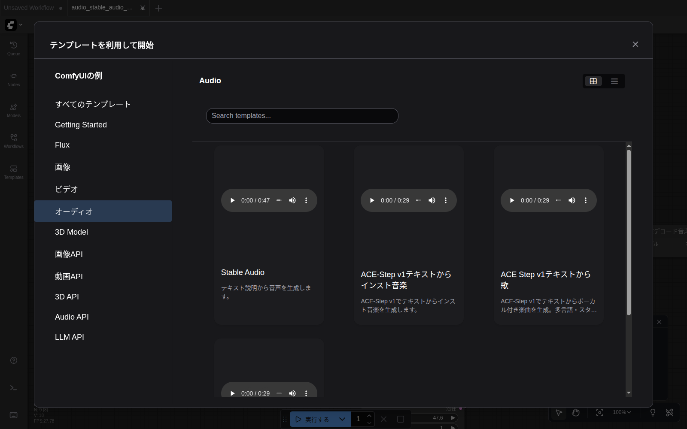
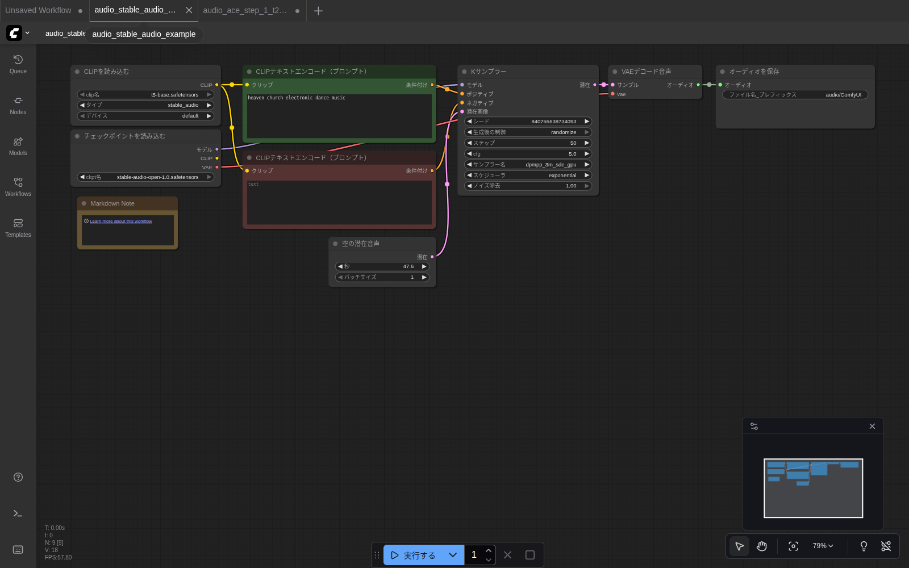
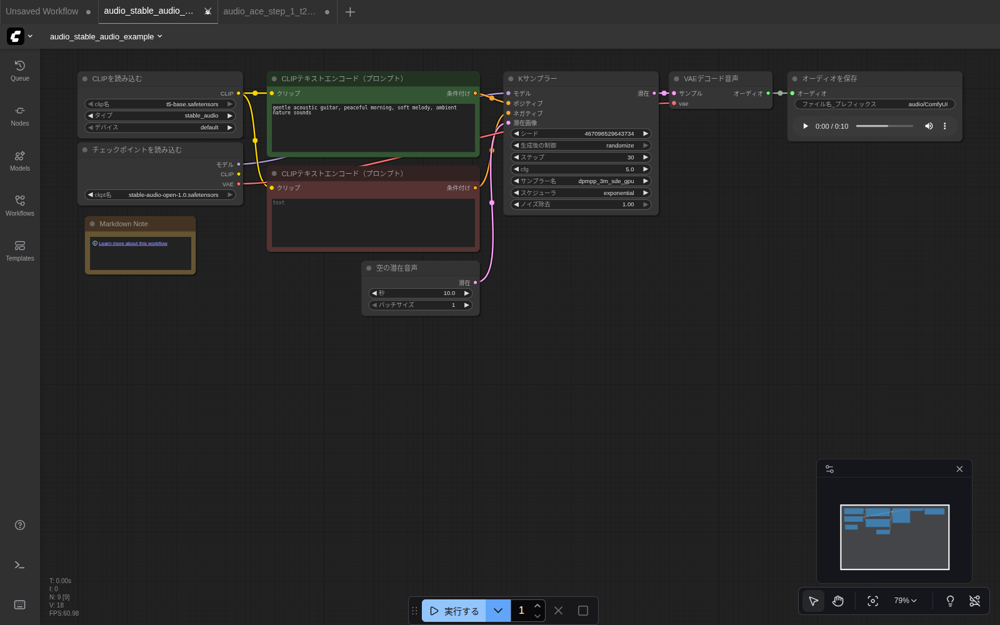

# 第7章 Stable Audio で音楽を作る

短いインストゥルメンタルや効果音、環境音を作るのに向いています。「教会のEDM」とか「波の音」とか、雰囲気を表す英文を投げると音にしてくれるイメージ。

## 用意するもの

第6章で次の2つをダウンロード済みであること。

- `models/checkpoints/stable-audio-open-1.0.safetensors`
- `models/text_encoders/t5-base.safetensors`

## ステップ1：テンプレートを開く

1. 左サイドバーの **Templates** をクリック
2. **オーディオ** カテゴリをクリック

   

3. **「Stable Audio」** カードをクリック

ワークフローが開きます。「モデルが見つかりません」が出た場合は **× で閉じる** （ファイルを置いた直後の場合、ブラウザを Ctrl+R でリロードしてから再度開く）。

ロードに成功すると、こんな画面になります：



## ステップ2：ノード構成を理解する

画像生成（第4章）と **だいたい同じ流れ** です。違うのは「画像→音」になった点だけ。

| ノード | 役割 | 画像生成での対応 |
|---|---|---|
| `CLIPを読み込む` (clip_name=`t5-base.safetensors`, type=`stable_audio`) | T5テキストエンコーダ読み込み | （SDXL は内部にCLIPを持つので不要） |
| `チェックポイントを読み込む` | 音楽モデル本体 | 同じ |
| `CLIPテキストエンコード` × 2 | プロンプト/ネガティブプロンプト | 同じ |
| `空の潜在音声` | 「真っ白な楽譜」を用意（**秒数指定**） | `空の潜在画像` と同じ位置 |
| `Kサンプラー` | 拡散プロセスを実行 | 同じ |
| `VAEデコード音声` | 潜在表現 → 音声波形 | `VAEデコード` の音声版 |
| `オーディオを保存` | `.flac` で保存 | `画像を保存` の音声版 |

## ステップ3：プロンプトを入れる

中央上の **`CLIPテキストエンコード（プロンプト）`** （ポジティブ側、緑色枠）に、生成したい音楽の雰囲気を **英語** で書き込みます。

例えば次のいずれかをコピペ：

```
gentle acoustic guitar, peaceful morning, soft melody, ambient nature sounds
```

```
electronic dance music, fast tempo, energetic, club beat
```

```
piano solo, melancholic, slow tempo, emotional, classical music
```

```
heavy metal guitar riff, distorted, aggressive drums, fast tempo
```

下のもう1つの `CLIPテキストエンコード` はネガティブです。空のままで構いませんが、嫌な要素を入れるなら：

```
low quality, distorted, noise, vocals
```

> 💡 **`vocals`（歌声）を避けたい場合** はネガティブに書いておくと効果あり。Stable Audio はインストゥルメンタル向きですが、ボーカル風の音が混ざることがあります。

## ステップ4：長さを決める

`空の潜在音声` ノードの **「秒」** の値が音の長さです。

- デフォルト: **47.6秒**（モデルが学習した最長）
- 試しに作るなら: **10秒** に下げると速い（数十秒〜1分で完了）
- 最大: 47.6秒（これより長くしても無視される）

> 💡 **長くするほど時間と VRAM を食います。** 初回は10秒で試して、気に入ったら長くしましょう。

## ステップ5：実行する

画面下中央の **「▶ 実行する」** をクリック。

進捗はタブのタイトルバーに `[X%][Y%] KSampler` の形で出ます。AMD Radeon VII で **10秒の音声を 30 ステップ** で生成すると約 **30〜60秒** で完了。

完了すると、`オーディオを保存` ノードに **再生プレイヤー** が表示されます。



▶ ボタンを押すと再生されます。気に入った音は `output/audio/ComfyUI_00001_.flac` のようなパスに保存されています（FLAC形式）。

このガイド執筆時に生成したサンプル：

🎵 [`screenshots/15_stable_audio_result.flac`](screenshots/15_stable_audio_result.flac)（10秒, FLAC, 約 580 KB, プロンプト: `gentle acoustic guitar, peaceful morning, soft melody, ambient nature sounds`）

## Kサンプラーの設定（音声版）

画像版と同じパラメータですが、音声向けの推奨値が少し違います。

| 項目 | 推奨値 |
|---|---|
| ステップ | 30〜50（多いほど密度が上がるが、効きは緩やか） |
| cfg | 4〜7（5.0 がデフォルト） |
| サンプラー名 | `dpmpp_3m_sde_gpu` がデフォルト |
| スケジューラ | `exponential` |

> 💡 **Stable Audio で「画像と同じ euler / normal」にしないこと。** モデルが想定したサンプラー組み合わせから外れると音が崩壊します。デフォルト値を尊重するのが安全。

## こんなとき・こんなプロンプト

| 作りたい雰囲気 | プロンプト例 |
|---|---|
| 雨音 | `heavy rain on rooftop, thunder in distance, ambient` |
| 焚き火 | `crackling campfire, gentle wind, peaceful evening` |
| 短いジングル | `upbeat happy jingle, cheerful ukulele, 5 second commercial` |
| ホラー BGM | `dark ambient drone, dissonant strings, horror soundtrack` |
| 8bit ゲーム音 | `chiptune 8-bit retro game music, fast melody, catchy` |
| 海岸 | `ocean waves on beach, seagulls in distance, peaceful` |

---

短い音は作れるようになりました。もう少し本格的に **楽曲っぽいもの** を作りたいときは、 [第8章 ACE-Step](08_ace_step.md) へ。
