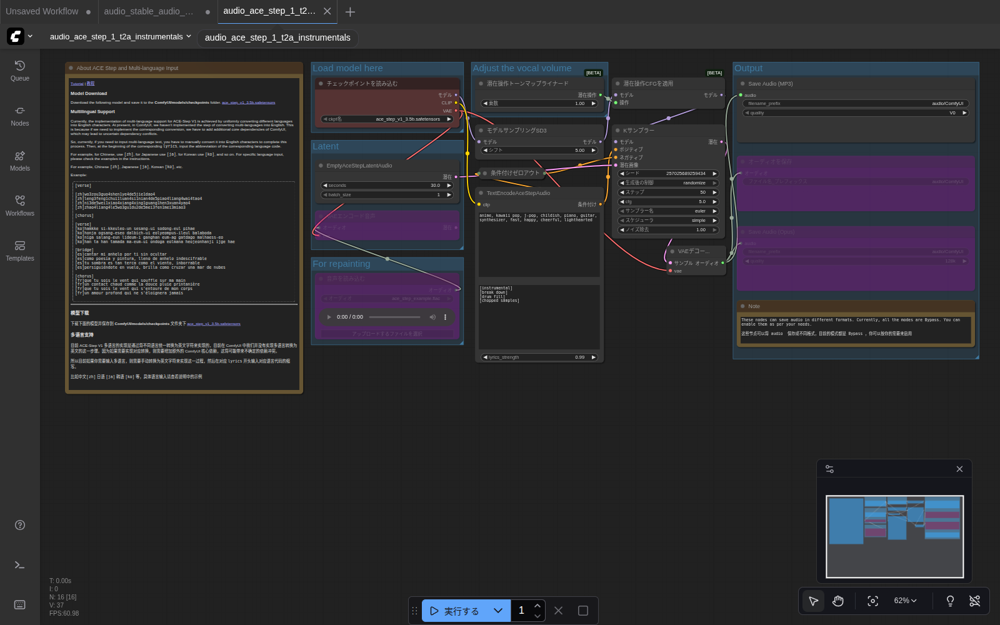
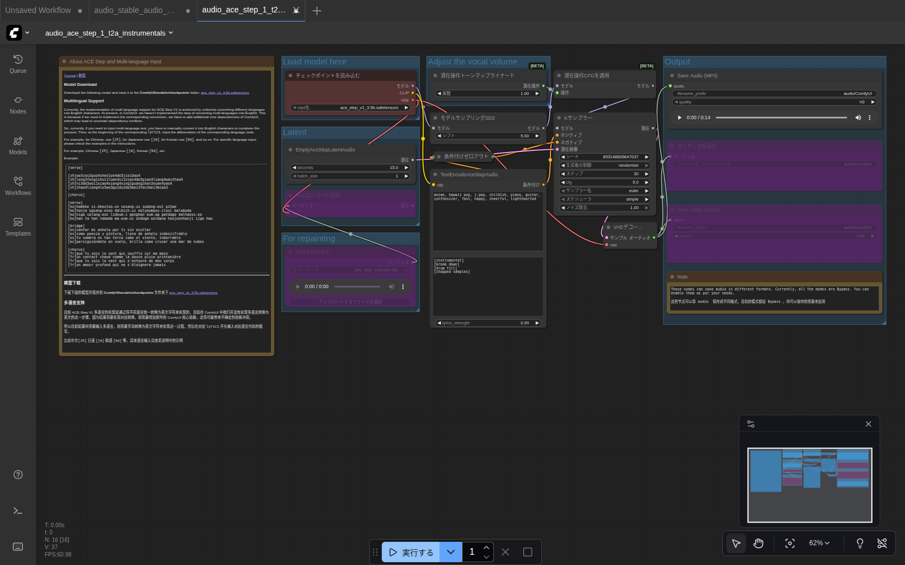

# 第8章 ACE-Step で音楽を作る

ACE-Step v1 は、ドラム・楽器・メロディが揃った **楽曲っぽい音楽** を作れるモデルです。最大4分弱まで作れて、歌詞（ボーカル）にも対応。Stable Audio より「音楽らしい音楽」が出ます。

## このガイドでカバーする範囲

ACE-Step には3つのテンプレートが用意されています。

| テンプレート | 何ができる |
|---|---|
| **ACE-Step v1 テキストからインスト音楽** | プロンプトから **ボーカルなし** の音楽を生成（このガイドではコレ） |
| ACE-Step v1 テキストから歌 | プロンプト + 歌詞 から **ボーカル付き** の楽曲を生成 |
| ACE-Step v1 オーディオから音楽 | 既存の音声を入力して、別の音楽に変換 |

歌入りやボーカル変換も同じ手順の延長で試せます。**まずはインストから始めましょう。**

## 用意するもの

第6章で次のファイルをダウンロード済みであること。

- `models/checkpoints/ace_step_v1_3.5b.safetensors`（7.2GB）

> 💡 ACE-Step は all-in-one モデルです。Stable Audio と違って、テキストエンコーダの追加ファイルは不要。

## ステップ1：テンプレートを開く

1. 左サイドバーの **Templates**
2. **オーディオ** カテゴリ
3. **「ACE-Step v1テキストからインスト音楽」** をクリック

モデルが見つかればワークフローが開きます。



> ⚠️ 画面が情報密度高めに見えますが、**注目すべきは右半分** だけ。左にある「About ACE Step」の説明書きと右の「For repainting」（リペイント機能、上級者向け）は今回触りません。

## ステップ2：見るべきノードはこの5つ

色のついた背景（グループ）でまとめられています。順番に追っていきましょう。

### Load model here（左側、赤系）
- `チェックポイントを読み込む` — `ace_step_v1_3.5b.safetensors` が選択されている

### Latent（中央左）
- `EmptyAceStepLatentAudio` — 「真っ白な楽譜」を用意。**`seconds`** が長さ（秒）

### Adjust the vocal volume（中央上 [BETA]）
- `潜在操作トーンマップラインアード` — ボーカル音量の調整。**今は触らない**

### TextEncodeAceStepAudio（中央）
ここが **プロンプトを入れる場所**。**2つの欄** があります。

- 上の `clip` 直下 → **タグスタイルのプロンプト**（楽器・ジャンル・雰囲気）
- 下 → **歌詞**。インストの場合は `[instrumental]` などの **構造タグだけ** を入れる

### Output（右端、紫系）
- `Save Audio (MP3)` が **唯一アクティブ**。他の `Save Audio (Opus)` `オーディオを保存` は **Bypass**（無効化）状態。

> 💡 **Bypass** された（半透明の）ノードは、スキップされて実行されません。MP3 出力だけ動く設定です。Opus 形式にしたい場合は、Save Audio (Opus) ノードを右クリック → Bypass を解除。

## ステップ3：プロンプトと歌詞を入れる

プロンプトのスタイルが Stable Audio とは違います。**カンマ区切りのタグ** が ACE-Step の流儀。

### プロンプト例（タグ）

すでにデフォルトで入っているサンプル：

```
anime, kawaii pop, j-pop, childish, piano, guitar, synthesizer, fast, happy, cheerful, lighthearted
```

他のジャンル例：

| ジャンル | タグ例 |
|---|---|
| ロックバラード | `rock, ballad, slow tempo, emotional, electric guitar, drums, male vocal energy` |
| シティポップ | `city pop, funk, bass-driven, jazzy chords, 80s japanese, smooth, retro` |
| Lo-Fi Hip Hop | `lo-fi, hip hop, chill, jazz piano, vinyl crackle, slow tempo, rainy night` |
| EDM | `edm, big room, festival, energetic drop, four on the floor, synth lead` |
| クラシック | `classical, orchestral, dramatic, strings, piano, cinematic` |

### 歌詞欄（インストの場合）

`[instrumental]` のような **構造タグ** を入れます。これらは AI に「ここはイントロ」「ここで盛り上げて」を伝える指示。

```
[instrumental]
[break_down]
[drum_fill]
[chopped_samples]
```

歌付き（次のステップ）にするなら `[verse]` の下に実際の歌詞を書きます（多言語対応：日本語の場合は `[ja]` プレフィクスをつけて行ごとに記述）。

## ステップ4：長さとステップを決める

| 設定箇所 | 設定値 | 目安 |
|---|---|---|
| `EmptyAceStepLatentAudio` の `seconds` | 30 | 最初は 15〜30 秒で試すと速い |
| `Kサンプラー` の `ステップ` | 50 | 30 まで下げてもOK（時間短縮） |
| `Kサンプラー` の `cfg` | 5.0 | デフォルトでOK |
| `Kサンプラー` の `サンプラー名` | `euler` | デフォルト |
| `Kサンプラー` の `スケジューラ` | `simple` | デフォルト |

## ステップ5：実行する

**「▶ 実行する」** をクリック。

完了するとこのような画面になります：



`Save Audio (MP3)` ノードに再生プレイヤーが出て、▶ ボタンで聴けます。ファイルは `output/audio/ComfyUI_00002_.mp3` のように保存されています。

このガイド執筆時に生成したサンプル：

🎵 [`screenshots/18_ace_step_result.mp3`](screenshots/18_ace_step_result.mp3)（14秒, MP3, 約 500 KB, プロンプト: `anime, kawaii pop, j-pop, childish, piano, guitar, synthesizer, fast, happy, cheerful, lighthearted`）

## ステップ6（応用）：歌入り曲を作る

「ACE-Step v1テキストから歌」テンプレートを開くと、歌詞欄に実際の歌詞を書く構造になっています。

例（日本語の歌詞）：
```
[verse]
[ja]きみと歩いた春の道
[ja]桜の花が舞っていた
[chorus]
[ja]ずっとずっと忘れない
[ja]あの日の空の青さを
```

`[ja]` のプレフィックスは「この行は日本語」と AI に伝えるタグです。`[en]` `[zh]` などにすれば多言語混在もOK。

> 💡 **歌詞の AI 生成** は完璧ではありません。子音が滑ったり、メロディとずれたりします。「短いリフレインを繰り返す」シンプルな歌詞のほうが綺麗に出ます。

## ACE-Step ならではの設定

中央上の `Adjust the vocal volume` グループ（[BETA]）は、**ボーカル付き楽曲のときだけ意味があります**。

| 設定 | 意味 |
|---|---|
| `潜在操作トーンマップラインアード` の `乗数` | ボーカル音量の倍率（1.0 がデフォルト、0 で無音、2 で強調） |

インストの場合は触らなくてOK。

## Stable Audio との使い分け

| やりたいこと | おすすめ |
|---|---|
| 効果音、環境音、雨音、波音 | Stable Audio |
| 短いジングル（〜10秒） | Stable Audio |
| ジャンルの分かる音楽（30秒〜） | ACE-Step |
| 歌入り楽曲 | ACE-Step（「歌」テンプレート） |
| 既存の音楽の編曲・変換 | ACE-Step（「オーディオから音楽」テンプレート） |

---

これで音楽生成の基本まで一通り学びました。最後に、つまずきやすいポイントを [第9章 困ったときに](09_troubleshooting.md) でまとめます。
